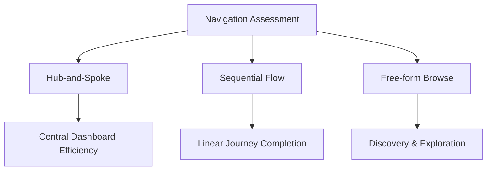

# 🎨 Comprehensive Web Design Analysis for Redesign Planning

> **Strategic Design Audit Framework** | *Transforming User Experience Through Data-Driven Design*

## 🎯 Context & Instructions

You are conducting a comprehensive design audit of [competitor/reference website] for internal redesign planning. Analyze the provided screenshots using advanced UX/UI principles and provide strategic recommendations.

### 📋 Analysis Framework
Apply Nielsen's 10 usability heuristics, Gestalt principles, and conversion optimization best practices throughout your evaluation.

---

## 1. 👁️ Visual Hierarchy & Information Architecture Assessment

### 🔍 Scanning Pattern Analysis
Evaluate using F-pattern and Z-pattern scanning behaviors:

- **Primary Visual Pathways** - Most critical user journeys
- **Secondary Visual Pathways** - Supporting content and navigation
- **Tertiary Visual Pathways** - Supplementary information
- **Information Scent** - Progressive disclosure effectiveness
- **Cognitive Load Distribution** - Interface element organization
- **Miller's Rule Compliance** - 7±2 navigation and content grouping

### 🤔 Critical Evaluation Questions

| Question | Focus Area |
|----------|------------|
| Does the visual weight guide users toward primary conversion goals? | Conversion Optimization |
| How effectively does the layout support different user journey stages? | User Experience Flow |
| Are there competing visual elements creating decision paralysis? | Decision Architecture |

---

## 2. 🎨 Color Psychology & Brand Perception Analysis

### 🌈 Color Strategy Framework

#### Core Color Analysis
- **🎯 Primary Brand Colors** - Psychological associations and brand alignment
- **♿ Accessibility Standards** - WCAG 2.1 AA contrast ratio compliance
- **🌡️ Color Temperature** - Emotional resonance with target demographics  
- **🏆 Competitive Positioning** - Differentiation through strategic color choices

#### 📊 Conversion Impact Assessment

```
High Impact Areas:
├── CTA Button Effectiveness
├── Trust Signal Colors  
├── Cultural Considerations
└── Journey Consistency
```

### 🔍 Evaluation Checklist

- [ ] **CTA Contrast** - Button color effectiveness against background
- [ ] **Trust Signals** - Credibility through strategic color choices
- [ ] **Cultural Sensitivity** - Target market color psychology
- [ ] **Journey Consistency** - Color harmony across touchpoints

---

## 3. 🔄 UX Pattern Evaluation & Usability Heuristics

### ⚡ Pattern Analysis Framework

#### 🧠 Cognitive Load Assessment
> **Jakob's Law**: Users prefer interfaces that work similarly to others they know

| Pattern Type | Evaluation Criteria | Impact Level |
|--------------|-------------------|--------------|
| **Familiar Patterns** | Recognition over recall | 🟢 Low cognitive load |
| **Novel Patterns** | Learning curve analysis | 🟡 Medium cognitive load |
| **Microinteractions** | Feedback mechanism quality | 🔵 Engagement driver |
| **Error Systems** | Prevention & recovery ease | 🔴 Critical for trust |

#### 🗺️ Navigation Paradigm Analysis



### 📱 Responsive Design Evaluation

- **🔧 Form Optimization** - Completion rate factors
- **🔍 Search & Filtering** - Discovery effectiveness
- **📱 Mobile-First Strategy** - Touch-optimized interactions
- **⬆️ Progressive Enhancement** - Feature layering approach

---

## 4. 📝 Typography System & Readability Assessment

### 🔧 Technical Typography Evaluation

#### ⚙️ Core Metrics Dashboard

| Metric | Optimal Range | Assessment Method |
|--------|---------------|-------------------|
| **Type Scale Ratio** | 1.125 - 1.618 (golden ratio) | Mathematical progression |
| **Line Length** | 45-75 characters | Reading comfort zone |
| **Line Height** | 1.4 - 1.6 | Vertical rhythm analysis |
| **Contrast Ratio** | 4.5:1 minimum | WCAG compliance check |

#### 🚀 Performance & Responsiveness

```css
/* Typography Performance Checklist */
font-display: swap;           /* ✅ Prevents FOIT */
font-variation-settings: ...;  /* ✅ Variable font optimization */
clamp(1rem, 2.5vw, 2rem);    /* ✅ Fluid typography */
```

### 🎭 Brand Alignment Analysis

#### 🎨 Personality Matrix

- **📢 Brand Voice Congruence** - Typography personality alignment
- **📑 Content Hierarchy** - Clear information architecture
- **♿ Accessibility Focus** - Dyslexia-friendly design patterns
- **🌍 Global Readiness** - Internationalization support

### 📊 Readability Score Card

- [ ] **Scanning Efficiency** - Easy content consumption
- [ ] **Reading Flow** - Natural eye movement patterns  
- [ ] **Cognitive Load** - Minimal mental processing effort
- [ ] **Cross-Device Consistency** - Uniform experience

---

## 5. 📈 Conversion Rate Optimization Opportunities

> **Impact-Driven Improvement Framework** | *Behavioral Psychology × Design Psychology*

### 🎯 CRO Template Structure

#### 🔬 Improvement Analysis Template

```
🏷️  Category: [Primary Focus Area]
❌  Current Issue: [Specific UX/design bottleneck]
🧠  Psychology Principle: [Behavioral trigger/barrier]
✅  Recommended Solution: [Actionable implementation]
📊  Expected Impact: [Quantifiable improvement]
⚡  Priority Level: [High/Medium/Low + reasoning]
```

### 💡 Strategic Improvement Framework

#### 🚀 **Improvement 1: [Category]**

- **❌ Current Issue:** [Specific problem with user flow/design]
- **🧠 Behavioral Psychology Principle:** [Social proof, loss aversion, anchoring, etc.]
- **✅ Recommended Solution:** [Detailed implementation approach]
- **📊 Expected Impact:** [Quantifiable improvement prediction]
- **⚡ Implementation Priority:** 
  - [ ] **High** - Quick win, major impact
  - [ ] **Medium** - Strategic initiative  
  - [ ] **Low** - Future consideration

#### 🎨 **Improvement 2: [Category]**

*[Follow same structure as Improvement 1]*

#### ⚡ **Improvement 3: [Category]**

*[Follow same structure as Improvement 1]*

---

## 6. 🎯 Strategic Recommendations for Redesign

### 📊 2x2 Priority Impact Matrix

```
High Impact │ 🚀 Strategic      │ ⚡ Quick Wins    │
            │    Initiatives    │                 │
            │                   │                 │
────────────┼───────────────────┼─────────────────┤
Low Impact  │ 🔍 Research       │ 🗂️ Nice-to-Have │
            │    Required       │                 │
            │                   │                 │
            └───────────────────┴─────────────────┘
             High Effort         Low Effort
```

#### ⚡ **Quick Wins** (Low effort, High impact)
- Color contrast improvements
- Typography hierarchy refinement  
- Micro-interaction enhancements
- Mobile touch target optimization

#### 🚀 **Strategic Initiatives** (High effort, High impact)
- Complete navigation restructure
- Advanced personalization features
- Multi-platform design system
- AI-driven content optimization

#### 🔍 **Research Required**
- User journey mapping validation
- A/B testing framework setup
- Competitive analysis deep-dive
- Performance impact assessment

#### 🏆 **Competitive Advantages**
- Unique value proposition highlighting
- Differentiated interaction patterns
- Brand personality amplification
- Innovation showcase opportunities

### 🛠️ Technical Implementation Roadmap

#### 🎨 **Design Considerations**
- **Performance Impact** - Loading time optimization
- **Development Complexity** - Implementation feasibility 
- **Testing Strategy** - A/B testing recommendations
- **Analytics Framework** - Measurement and iteration plan

#### 📈 **Success Metrics**
- User engagement rates
- Conversion funnel improvements  
- Task completion efficiency
- Brand perception metrics

---

## 🚀 Ready to Transform Your Design?

This framework provides the foundation for data-driven design decisions. Use each section as a checklist for comprehensive design analysis and strategic improvement planning.