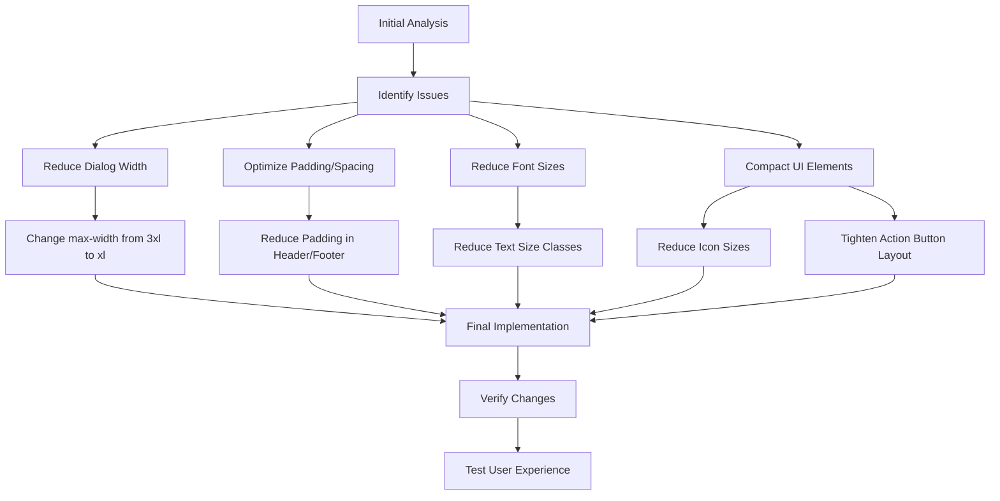

# Saved Schedules Modal Redesign for Desktop View

## Problem Statement
The Saved Schedules modal was too large on desktop view, taking up excessive screen space and not providing an optimal user experience.

## Action Flow Diagram

## Key Changes Made

### 1. Dialog Container Size
- Reduced maximum width from `max-w-3xl` to `max-w-xl`
- Maintained maximum height at 85% of viewport

### 2. Header Optimization
- Reduced padding from `p-6 pb-4` to `p-4 pb-3`
- Decreased title font size from `text-xl` to `text-lg`
- Retained badge count for visual clarity

### 3. Content Area Improvements
- Reduced side padding from 6 to 3 units
- Decreased vertical spacing between items
- Added custom padding override with `!py-3` for schedule cards

### 4. Card Content Enhancements
- Decreased font sizes (base text from `text-lg` to `text-base`)
- Reduced metadata text from `text-sm` to `text-xs`
- Optimized icon sizes from 5×5 to 4×4 (20% reduction)
- Condensed rotation badge with smaller padding and text

### 5. Action Buttons
- Reduced minimum dimensions from 44×44px to 36×36px
- Tightened spacing between action buttons
- Maintained touch targets within accessibility guidelines

### 6. Footer Optimization
- Reduced padding from 6 to 3 units
- Maintained a single clear "Close" button

## Before vs After Comparison

### Before
- Dialog takes up significant screen space
- Excessive padding creates visual "emptiness"
- Large text and icons make modal feel oversized
- Single-column layout feels inefficient

### After
- More compact presentation with reduced width
- Optimized spacing provides density without crowding
- Smaller text and icon sizing feels proportional
- Enhanced information density while maintaining readability

## User Benefits
1. More content visible without scrolling
2. Less visual interruption of workflow
3. Maintains all functionality in a more efficient layout
4. Feels lighter and more modern

This redesign improves user experience by providing a more compact, efficient interface while maintaining all functionality and accessibility standards.